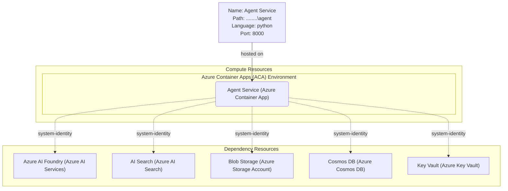

# Azure AI Foundry Agentic Application Architecture

## Architecture Overview

## Architecture Components

### Compute Layer

- **Azure Container Apps**: Hosts the agentic application with automatic scaling, minimal operational overhead, and integrated networking.

### AI & Data Layer

- **Azure AI Foundry**: Central platform for developing, managing, and deploying AI agents with model orchestration, prompt engineering, and evaluation capabilities.
- **Azure AI Search**: Vector and hybrid search capabilities for semantic understanding, retrieval-augmented generation (RAG), and semantic caching.
- **Blob Storage**: Document storage and processing for unstructured data ingestion and archival.
- **Cosmos DB**: NoSQL database for operational data, agent state management, and conversation history.

### Security Layer

- **Azure Key Vault**: Secure storage for API keys, connection strings, and secrets with audit logging.
- **Managed Identity**: System-assigned identity for secure, keyless authentication between services.

### Observability (Recommended)

- **Application Insights**: Distributed tracing, performance monitoring, and AI-specific diagnostics for agent behavior analysis.

## Azure Well-Architected Framework Alignment

### 1. **Reliability**

- Multi-region support through Azure AI Foundry managed service
- Automatic failover and scaling via Container Apps
- Circuit breaker patterns for downstream service calls
- Comprehensive error handling and retry logic

### 2. **Security**

- System-assigned managed identities eliminate credential management
- Azure Key Vault for centralized secret management
- Network security via private endpoints (if needed)
- Azure AI Safety features and content filtering via Azure AI Foundry
- RBAC-based access control for all services
- Audit logging across AI operations and data access

### 3. **Cost Optimization**

- Container Apps with consumption-based pricing
- Azure AI Foundry flexible pricing models
- Blob Storage lifecycle policies for data archival
- Optimized vector search indexing
- Pay-per-use models for AI services

### 4. **Operational Excellence**

- Infrastructure as Code (Bicep/Terraform)
- Integrated monitoring via Application Insights
- Automated deployments via Azure DevOps or GitHub Actions
- Role-based responsibilities and GitOps practices
- Comprehensive audit trails and compliance logging

### 5. **Performance Efficiency**

- Horizontal scaling in Container Apps based on workload
- Cache optimization through Azure AI Search semantic caching
- Efficient vector indexing and retrieval
- Optimized container images and cold start performance
- Request aggregation and batch processing capabilities

## Data Flow

1. **Agent Invocation**: Client requests reach the Agent Service via HTTP/REST API
2. **Orchestration**: Azure AI Foundry coordinates agent logic, tools, and model calls
3. **Data Retrieval**: Agent queries AI Search for semantic knowledge and Cosmos DB for operational data
4. **Document Processing**: Blob Storage provides source documents for ingestion
5. **Security**: All access is authenticated via managed identities using Key Vault secrets
6. **Observability**: All operations are logged and monitored through Application Insights

## Deployment Architecture Patterns

### Development

- Local development with integrated Azure services
- Container registries for image management
- Staged deployments via Blue-Green or Canary patterns

### Production

- Multi-environment setup (Dev, Test, Prod)
- Automated CI/CD pipelines
- Health checks and readiness probes
- Auto-scaling policies based on metrics

## Recommendations for Your Customer

1. **Start with MVP**: Deploy core agent with AI Search and Cosmos DB
2. **Monitor Early**: Enable Application Insights from day one for behavior insights
3. **Implement GitOps**: Use Infrastructure as Code for reproducible deployments
4. **Security First**: Use managed identities and Key Vault from the beginning
5. **Agent Evaluation**: Leverage Azure AI Foundry's built-in evaluation datasets
6. **Cost Management**: Set up budget alerts and monitor vector index costs
7. **Compliance**: Enable audit logging for regulatory requirements if needed

## Next Steps

1. Define specific agent capabilities and required AI models
2. Plan vector index strategy for AI Search
3. Determine data schema for Cosmos DB application state
4. Set up Azure DevOps/GitHub Actions CI/CD pipelines
5. Configure monitoring dashboards for AI metrics
