# ElderCare Facility Management Platform — Architecture

## Architecture Overview

```mermaid
graph TD
  %% ─── External Users ──────────────────────────────────────────────────────
  FamilyPortal["🏠 Family Portal\n(React SPA)"]
  StaffDashboard["🩺 Staff Dashboard\n(React SPA)"]
  MobileApp["📱 Mobile App\n(Nurse / Carer)"]
  IoTSensors["📡 IoT Device Fleet\n(Wearables, Fall Detectors, Motion)"]

  %% ─── Ingress Layer ───────────────────────────────────────────────────────
  subgraph apim["Azure API Management (APIM)"]
    APIMGateway["API Gateway\nRate Limiting · Auth · Routing"]
  end

  subgraph b2c["Azure AD B2C"]
    IdentityProvider["Identity & Consent\n(Family / Staff / Admin)"]
  end

  %% ─── AKS Cluster ─────────────────────────────────────────────────────────
  subgraph aks["AKS Cluster — ElderCare Platform (Zone-Redundant)"]
    direction TB

    subgraph ingress_ns["ingress namespace"]
      NginxIngress["NGINX Ingress Controller"]
    end

    subgraph core_ns["core-services namespace"]
      ResidentSvc["Resident Activity Service\nPython · FastAPI"]
      MedSvc["Medication Service\nPython · FastAPI"]
      MedicalSvc["Medical Records Service\nPython · FastAPI"]
      NotifSvc["Notification Orchestrator\nPython · FastAPI"]
      EmergencySvc["Emergency Response Service\nPython · FastAPI"]
      AnalyticsSvc["Health Analytics Agent\nPython (AI Foundry SDK)"]
    end

    subgraph jobs_ns["jobs namespace"]
      MedScheduler["Medication Reminder\nCronJob"]
      ActivityDigest["Daily Activity Digest\nCronJob"]
      AnomalyDetector["Vitals Anomaly Detector\nCronJob"]
    end

    subgraph selfheal_ns["self-healing (AKS Observability Demo)"]
      LivenessProbe["Liveness Probes\n(all pods)"]
      ReadinessProbe["Readiness Probes\n(all pods)"]
      HPA["Horizontal Pod Autoscaler"]
      KEDA["KEDA — Event-Driven Scaling\n(IoT Hub queue depth)"]
    end
  end

  %% ─── IoT Ingestion ───────────────────────────────────────────────────────
  subgraph iot["IoT Ingestion Layer"]
    IoTHub["Azure IoT Hub\n(Device registry + telemetry)"]
    EventHub["Azure Event Hubs\n(Telemetry stream)"]
    StreamAnalytics["Azure Stream Analytics\n(Real-time threshold alerts)"]
  end

  %% ─── Messaging ───────────────────────────────────────────────────────────
  subgraph messaging["Async Messaging"]
    ServiceBus["Azure Service Bus\nQueues: medication-due · emergency-alert\nTopics: activity-log · vitals-stream"]
  end

  %% ─── AI & Intelligence ───────────────────────────────────────────────────
  subgraph ai["Azure AI Foundry"]
    FoundryAgent["Health Insight Agent\n(GPT-4o + custom tools)"]
    AISearch["Azure AI Search\n(RAG: medical guidelines)"]
    ContentSafety["Azure AI Content Safety"]
  end

  %% ─── Data Layer ──────────────────────────────────────────────────────────
  subgraph data["Data Layer"]
    CosmosDB["Azure Cosmos DB\nResident profiles · Activity logs\nMedication records · Alerts"]
    PostgreSQL["Azure Database for PostgreSQL\nMedical records · Diagnoses\nClinical notes (FHIR-aligned)"]
    RedisCache["Azure Cache for Redis\nSession cache · Med schedule cache\nReal-time vitals buffer"]
    BlobStorage["Azure Blob Storage\nDocument uploads · Imaging\nAudit archives"]
    DigitalTwins["Azure Digital Twins\nFacility spatial model\nRoom ↔ Resident mapping"]
  end

  %% ─── Notifications ───────────────────────────────────────────────────────
  subgraph notif["Notification Channels"]
    NotifHub["Azure Notification Hubs\n(Push to mobile)"]
    CommServices["Azure Communication Services\n(SMS · Email · Voice alerts)"]
  end

  %% ─── Security ────────────────────────────────────────────────────────────
  subgraph security["Security Layer"]
    KeyVault["Azure Key Vault\nSecrets · Certs · Keys"]
    ManagedIdentity["Managed Identity\n(Workload Identity per service)"]
  end

  %% ─── Observability Stack (CSA Support MCP + Ops Advisor) ─────────────────
  subgraph observability["Observability Stack"]
    AppInsights["Azure Application Insights\nDistributed tracing · Custom metrics"]
    LogAnalytics["Log Analytics Workspace\nKQL dashboards · Alerts"]
    Monitor["Azure Monitor\nPlatform metrics · Alerts"]
    Workbooks["KQL Workbooks\nElderCare health dashboard"]
  end

  %% ─── MCP Tool Integrations ───────────────────────────────────────────────
  subgraph mcp_tools["MCP Tool Layer (Operational Intelligence)"]
    CSA_MCP["CSA Support MCP Tools\nquery_logs · get_resource_health\nlist_resources · create_incident\nget_azure_metrics · send_summary_email"]
    OpsAdvisor["Enterprise Cloud Ops Advisor MCP\nazure_operational_overview\nquery_logs · cost_hotspots\npropose_controlled_action\narchitecture_guidance"]
    AKSDemo["AKS Observability Self-Healing Demo\nTelemetry Module · Health Endpoints\nSelf-Healing Runbooks · KQL Workbooks"]
  end

  %% ─── Connections ─────────────────────────────────────────────────────────
  FamilyPortal & StaffDashboard & MobileApp --> APIMGateway
  APIMGateway --> IdentityProvider
  APIMGateway --> NginxIngress
  NginxIngress --> ResidentSvc & MedSvc & MedicalSvc & NotifSvc & EmergencySvc & AnalyticsSvc

  IoTSensors --> IoTHub --> EventHub --> StreamAnalytics
  StreamAnalytics --> ServiceBus
  ServiceBus --> ResidentSvc & EmergencySvc & NotifSvc

  AnalyticsSvc --> FoundryAgent
  FoundryAgent --> AISearch
  FoundryAgent --> ContentSafety
  FoundryAgent --> CosmosDB

  MedScheduler & ActivityDigest & AnomalyDetector --> ServiceBus

  ResidentSvc & MedSvc & MedicalSvc --> CosmosDB & RedisCache
  MedicalSvc --> PostgreSQL
  ResidentSvc --> DigitalTwins & BlobStorage
  NotifSvc --> NotifHub & CommServices

  ManagedIdentity -.-> ResidentSvc & MedSvc & MedicalSvc & AnalyticsSvc
  KeyVault -.-> ManagedIdentity

  AppInsights --> LogAnalytics --> Monitor --> Workbooks
  ResidentSvc & MedSvc & MedicalSvc & EmergencySvc & AnalyticsSvc -.-> AppInsights

  CSA_MCP --> LogAnalytics & Monitor
  OpsAdvisor --> LogAnalytics & Monitor & CosmosDB
  AKSDemo --> LivenessProbe & ReadinessProbe & HPA & KEDA & AppInsights
```



---

## Architecture Components

### 1. Client Layer

| Component | Technology | Purpose |
|---|---|---|
| Family Portal | React SPA → Azure Static Web Apps | Resident status, activity feed, messaging with staff |
| Staff Dashboard | React SPA → Azure Static Web Apps | Resident roster, medication queue, incident management |
| Mobile App | React Native / PWA | Nurse rounds, bedside medication confirmation, emergency trigger |

### 2. Ingress & Identity

| Component | Azure Service | Role |
|---|---|---|
| API Gateway | Azure API Management | Rate limiting, JWT validation, request routing, API versioning |
| Identity | Azure AD B2C | Family, staff, admin role separation; social login for families |

### 3. AKS Microservices (Core Services Namespace)

| Service | Stack | Responsibilities |
|---|---|---|
| **Resident Activity Service** | Python / FastAPI | Tracks meals, sleep, mobility events from IoT stream; writes to Cosmos DB |
| **Medication Service** | Python / FastAPI | CRUD for medication prescriptions, dispense confirmation, schedule engine |
| **Medical Records Service** | Python / FastAPI | FHIR-aligned health records, diagnosis history, lab results in PostgreSQL |
| **Notification Orchestrator** | Python / FastAPI | Fan-out: push, SMS, email via Azure Notification Hubs + Communication Services |
| **Emergency Response Service** | Python / FastAPI | Receives high-priority alerts from Service Bus, escalates per care plan |
| **Health Analytics Agent** | Python / AI Foundry SDK | Calls Azure AI Foundry GPT-4o agent for trend analysis, anomaly insight |

### 4. AKS Scheduled Jobs (Jobs Namespace)

| CronJob | Schedule | Action |
|---|---|---|
| Medication Reminder | Every 15 min | Queries due medications, publishes to `medication-due` Service Bus queue |
| Daily Activity Digest | 06:00 daily | Aggregates previous-day activity; emails family summary via Communication Services |
| Vitals Anomaly Detector | Every 5 min | Runs KQL against Log Analytics for vital-sign threshold breaches |

### 5. IoT Ingestion Layer

- **Azure IoT Hub**: Device registry for wearables (heart rate, SpO₂, fall detection), room motion sensors, door contact sensors.
- **Azure Event Hubs**: Telemetry firehose from IoT Hub for high-throughput ingestion (millions of events/day).
- **Azure Stream Analytics**: Real-time CEP rules — fall detection → emergency alert, vitals threshold breach → alert event published to Service Bus.

### 6. Azure AI Foundry — Health Insight Agent

The central intelligence layer, built on Azure AI Foundry:

- **GPT-4o base model** with a custom system prompt tuned for geriatric care.
- **Custom tools** bound to the agent:
  - `get_resident_vitals(resident_id, days)` — reads Cosmos DB
  - `get_medication_compliance(resident_id)` — queries Medication Service
  - `search_care_guidelines(query)` — queries Azure AI Search (indexed NICE, WHO elder-care guidelines)
  - `flag_anomaly(resident_id, finding)` — publishes to Service Bus emergency topic
- **Evaluation loop**: Periodic offline evaluation of agent responses against ground truth from nursing notes.
- **Content Safety**: All AI responses filtered for harmful or hallucinatory clinical content.

### 7. Data Layer

| Store | Azure Service | Data Domain |
|---|---|---|
| Resident & Activity | Cosmos DB (NoSQL) | Profiles, activity timelines, medication logs, alert history |
| Medical Records | Azure Database for PostgreSQL Flexible Server | FHIR-aligned clinical records, diagnoses, lab results |
| Session / Schedule Cache | Azure Cache for Redis | Medication schedule cache, active session state, real-time vitals buffer |
| Documents & Imaging | Azure Blob Storage | Consent forms, wound photos, radiology images, audit archives |
| Spatial Model | Azure Digital Twins | Floor plan topology, room-to-resident assignments, asset tracking |

### 8. Security Layer

- **Workload Identity** per AKS service (Azure AD federated identity) — no static secrets in pods.
- **Azure Key Vault** stores all secrets, certificates, and encryption keys. RBAC-gated access.
- **APIM Policies**: JWT validation, IP allowlisting for family portal, TLS 1.2+ enforcement.
- **Private Endpoints**: Cosmos DB, PostgreSQL, Redis, Storage — all reachable only within VNet.
- **Azure Policy**: Deny public endpoints, enforce tagging, audit HIPAA-relevant controls.

---

## MCP Tool Integration Map

### CSA Support MCP Tools (`csa-support-mcp-tools`)

Integrated into the ElderCare NOC (Network Operations Center) workflow:

| MCP Tool | ElderCare Use Case |
|---|---|
| `query_logs` | KQL: medication non-compliance events last 24 h; emergency alert latency p99 |
| `get_resource_health` | Validate IoT Hub, Cosmos DB, PostgreSQL health before daily standup |
| `list_resources` | Audit all resources tagged `env=production` and `app=eldercare` |
| `create_incident` | Auto-create P1 incident when `EmergencyResponseService` latency > 3 s |
| `get_azure_metrics` | CPU/memory per AKS node pool; Event Hub lag; Service Bus dead-letter count |
| `send_summary_email` | Daily operational summary to facility ops manager |

**Sample KQL query via `query_logs`:**
```kql
AppRequests
| where AppRoleName == "emergency-response-service"
| summarize p99=percentile(DurationMs, 99), p50=percentile(DurationMs, 50) by bin(TimeGenerated, 5m)
| order by TimeGenerated desc
```

### Enterprise Cloud Operations Advisor MCP (`enterprise-cloud-operations-advisor-mcp`)

| MCP Tool | ElderCare Use Case |
|---|---|
| `azure_operational_overview` | Daily resource inventory check for `rg-eldercare-prod` |
| `query_logs` | Cost anomaly detection via Billing logs; security audit trail |
| `cost_hotspots` | Identify top-spend services; track IoT Hub message units |
| `security_findings` | Surface High/Critical Defender for Cloud findings on ElderCare resources |
| `architecture_guidance` | Get WAF guidance for `ai-workload` + `high` criticality for the AI agent tier |
| `propose_controlled_action` | Propose AKS scale-out of `emergency-response-service` during peak hours |
| `execute_controlled_action` | Execute approved scale actions with audit token |

**Guidance profile used:**
```json
{
  "workloadType": "ai-workload",
  "criticality": "high"
}
```
→ Returns: prompt/content filters, token budgets, multi-zone placement, approval gates for prod changes.

### AKS Observability Self-Healing Demo

All AKS pods in ElderCare adopt the patterns from this demo:

| Pattern | Applied To |
|---|---|
| Liveness probes | All 6 core-services pods: `/health/live` endpoint, failureThreshold=3 |
| Readiness probes | All pods: `/health/ready` (dependency checks: Cosmos DB, Redis) |
| Startup probes | `health-analytics-agent` (slow AI SDK init): initialDelaySeconds=30 |
| HPA | `resident-activity-service`: scale 2→20 on CPU>60% |
| KEDA | `emergency-response-service`: scale on Service Bus `emergency-alert` queue depth |
| Telemetry Module | Python App Insights decorator on all service handlers |
| KQL Workbooks | ElderCare-specific workbook: Med compliance %, Active emergencies, IoT lag |
| Self-healing runbooks | Node drain + pod redistribution triggered by Azure Compute Health events |

---

## Data Flow — Key Scenarios

### Scenario A: Fall Detection → Emergency Alert

```
IoT Sensor (fall detected)
  → IoT Hub (device telemetry)
  → Event Hubs (stream)
  → Stream Analytics (CEP rule: fall event)
  → Service Bus [emergency-alert topic]
  → Emergency Response Service (KEDA-scaled pod)
  → Notification Orchestrator
      ├─ Push notification → nurse mobile app (Notification Hubs)
      ├─ SMS → family (Communication Services)
      └─ Email → on-call GP (Communication Services)
  → Cosmos DB: alert record
  → CSA Support MCP: auto-creates Critical incident
```

### Scenario B: Medication Due → Dispense Confirmation

```
Medication Scheduler CronJob (every 15 min)
  → Service Bus [medication-due queue]
  → Medication Service
  → Notification Orchestrator → Push to nurse mobile (due reminder)
  → Nurse scans QR on medicine cart → Medication Service (confirm dispense)
  → Cosmos DB: dispense record logged
  → Daily Digest CronJob: compliance % computed
  → Family Portal: compliance timeline updated
```

### Scenario C: AI Health Trend Analysis

```
Health Analytics Agent (scheduled or triggered)
  → Azure AI Foundry (GPT-4o + custom tools)
      ├─ get_resident_vitals() → Cosmos DB
      ├─ get_medication_compliance() → Medication Service
      └─ search_care_guidelines() → AI Search (RAG)
  → Content Safety filter
  → Structured JSON insight → Cosmos DB
  → Staff Dashboard: insight card displayed
  → Anomalous finding → flag_anomaly() → Service Bus [emergency-alert]
```

---

## Azure Well-Architected Alignment

| Pillar | Key Decisions |
|---|---|
| **Reliability** | Zone-redundant AKS + Cosmos DB multi-region writes; self-healing probes; KEDA surge scaling |
| **Security** | Workload Identity, private endpoints, APIM JWT, Key Vault, Azure Policy (HIPAA controls), Content Safety on AI outputs |
| **Cost Optimization** | KEDA scale-to-zero for batch jobs; Cosmos DB serverless for low-write services; Blob lifecycle tiering |
| **Operational Excellence** | MCP tool–driven NOC workflows; GitOps (Flux) for AKS; approval-gated prod changes via OpsAdvisor |
| **Performance Efficiency** | Redis cache for medication schedules; AI Search semantic cache; HPA on resident-activity-service |

---

## Deployment Topology

```
Resource Group: rg-eldercare-prod (eastus2 primary)
  ├── AKS Cluster (zone 1,2,3)
  ├── Azure API Management (Premium, zone-redundant)
  ├── Azure IoT Hub (S2 tier)
  ├── Azure Event Hubs (Standard, 4 TU)
  ├── Azure Stream Analytics (3 SU)
  ├── Azure Service Bus (Premium, geo-DR)
  ├── Azure AI Foundry Hub + Project
  ├── Azure AI Search (Standard S1)
  ├── Cosmos DB Account (multi-write: eastus2 + westus2)
  ├── Azure Database for PostgreSQL Flexible Server (zone-redundant HA)
  ├── Azure Cache for Redis (Premium P1, zone-redundant)
  ├── Azure Blob Storage (GRS, lifecycle policy)
  ├── Azure Digital Twins
  ├── Azure Notification Hubs (Standard)
  ├── Azure Communication Services
  ├── Azure AD B2C Tenant
  ├── Azure Key Vault (Premium, soft-delete, purge protection)
  ├── Log Analytics Workspace
  ├── Application Insights
  └── Azure Static Web Apps (Family Portal + Staff Dashboard)
```
