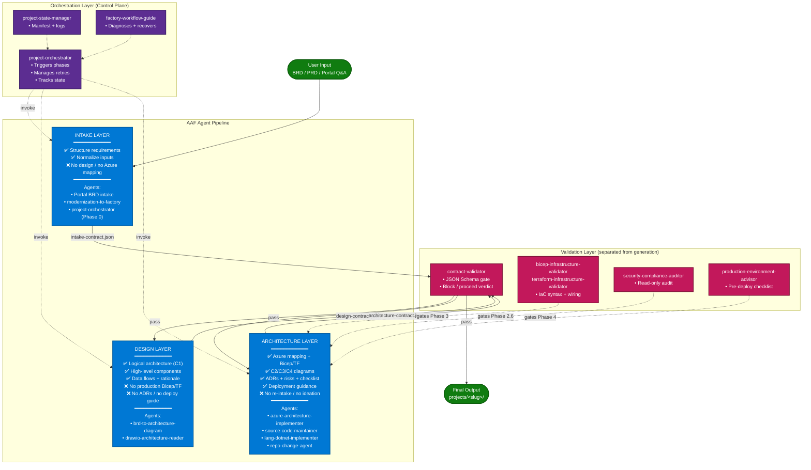

# AAF Agent Scoping Model

This document layers a clean **3-tier conceptual model** (Intake → Design → Architecture) on top of AAF's 20 concrete agents. It exists to answer one question:

> *"Which agent owns this responsibility, and what does it hand off?"*

It is the result of a scoping audit that identified three gaps in earlier versions of AAF — **implicit contracts**, **no validation/generation separation**, and **no orchestrator boundary**. All three are now closed.

## TL;DR

| Layer | Owns | Boundary contract | Real AAF agents involved |
|-------|------|-------------------|--------------------------|
| **Intake** | Normalize raw requirements into a structured, machine-readable summary. | [`intake-contract.schema.json`](../factory-templates/contracts/intake-contract.schema.json) | Portal BRD intake, `modernization-to-factory` (Phases 1–4), `project-orchestrator` Phase 0 |
| **Design** | Produce a logical / conceptual architecture (C1 + candidate Azure services + data flow + rationale). NO production code, NO Bicep/Terraform. | [`design-contract.schema.json`](../factory-templates/contracts/design-contract.schema.json) | `brd-to-architecture-diagram`, `drawio-architecture-reader` |
| **Architecture** | Produce production-ready code, infra, ADRs, risks, and deployment guidance — gated by alignment, security, error-handling, scalability, and test convergence. | [`architecture-contract.schema.json`](../factory-templates/contracts/architecture-contract.schema.json) | `azure-architecture-implementer`, `source-code-maintainer`, `lang-dotnet-implementer`, `bicep-infrastructure-validator`, `terraform-infrastructure-validator`, `security-compliance-auditor`, `production-environment-advisor`, `azure-project-deployer`, `project-traceability-advisor` |

Cross-cutting:

- **Orchestration (control plane)** — `project-orchestrator`, `project-state-manager`, `factory-workflow-guide`
- **Validation (separated from generation)** — `contract-validator` (NEW)
- **Post-deploy** — `project-cost-analyzer`, `project-observability-advisor`, `factory-handoff`

## Pipeline diagram

## Layer details

### 1. Intake Layer — *Requirement Structuring*

| ✅ Owns | ❌ Does NOT own |
|--------|----------------|
| Collect raw BRD/PRD or guided portal answers | Architecture or design decisions |
| Normalize into `requirements.functional[]` + `non_functional[]` | Azure service selection |
| Capture constraints (region, compliance, budget, language, IaC) | Diagram generation |
| Emit `intake-contract.json` | Code or infra generation |

**Done condition:** all required fields in [`intake-contract.schema.json`](../factory-templates/contracts/intake-contract.schema.json) populated; `contract-validator` returns `next_action: proceed`.

### 2. Design Layer — *Conceptual Architecture*

| ✅ Owns | ❌ Does NOT own |
|--------|----------------|
| Logical pattern selection (microservices, event-driven, etc.) | Bicep / Terraform code |
| C1-level components + responsibilities + candidate Azure services | ADRs, risk register |
| Data-flow graph with classification + auth | Production-readiness checklist |
| Design rationale linked back to requirement IDs | Cost or quota validation |
| Drawio + companion notes via MCP Draw.io workflow | |

**Done condition:** logically sound, every component links to ≥1 requirement id, `contract-validator` returns `next_action: proceed` against the design schema.

### 3. Architecture Layer — *Production Architecture*

| ✅ Owns | ❌ Does NOT own |
|--------|----------------|
| Bicep or Terraform for every resource | Re-intake of requirements |
| Source code (Python or .NET) per service | Initial ideation / pattern choice (came from Design) |
| Tests, dockerfiles, NFR materialization | Portal UI / packaging |
| ADRs, risks, deployment guidance | |
| Gate outcomes (alignment, security, error-handling, scalability, infra, tests) | |

**Done condition:** every gate in `architecture-contract.gate_results` is `pass` or carries a documented `skip_reason`; `contract-validator` returns `next_action: proceed`.

## How the gaps are closed

| Gap from scoping audit | Resolution |
|-----------------------|------------|
| Implicit contracts between agents | JSON Schemas in [`factory-templates/contracts/`](../factory-templates/contracts/), referenced by name from each agent. |
| No separation of generation and validation | New [`contract-validator`](../.github/agents/contract-validator.agent.md) agent — read-only, schema-gated. |
| Orchestrator boundary unclear | This doc + `project-orchestrator` Phase 0 now persists `intake.json`, Phase 1 persists `design.json`, Phase 3 persists `architecture.json`, each followed by a `contract-validator` call. |

## Maturity

| | "Pipeline of agents" | **AAF today** |
|-|---------------------|---------------|
| Contracts | implicit | typed JSON schemas |
| Validation | inline in generators | separate agent |
| Orchestration | ad hoc | `project-orchestrator` + `project-state-manager` |
| Audit trail | log-only | manifest + per-phase contract instance + validation report |
