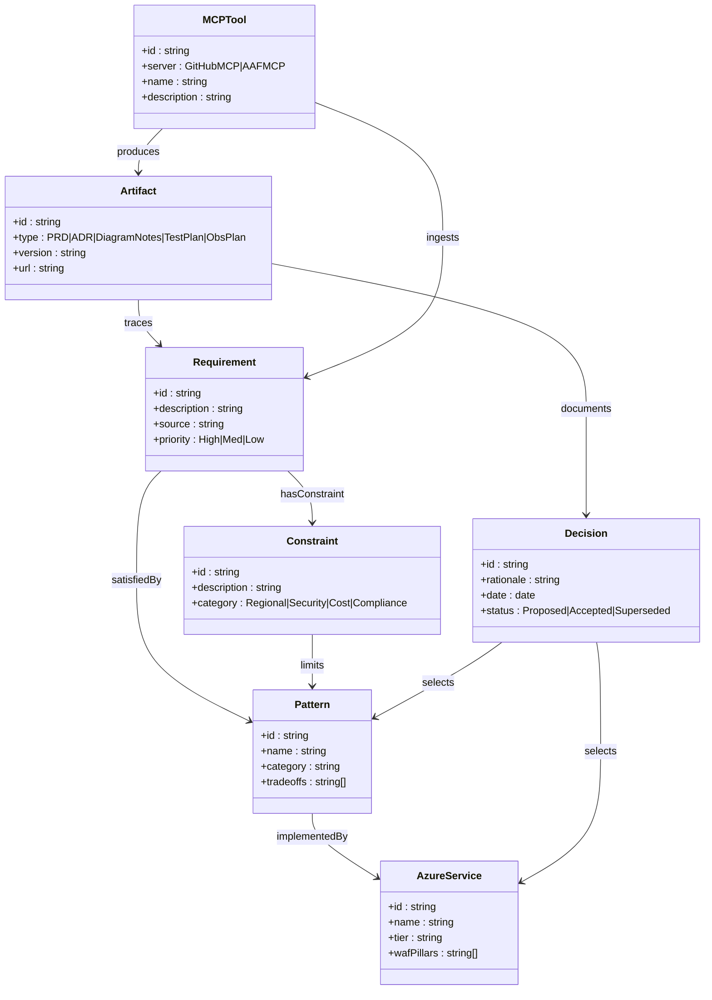
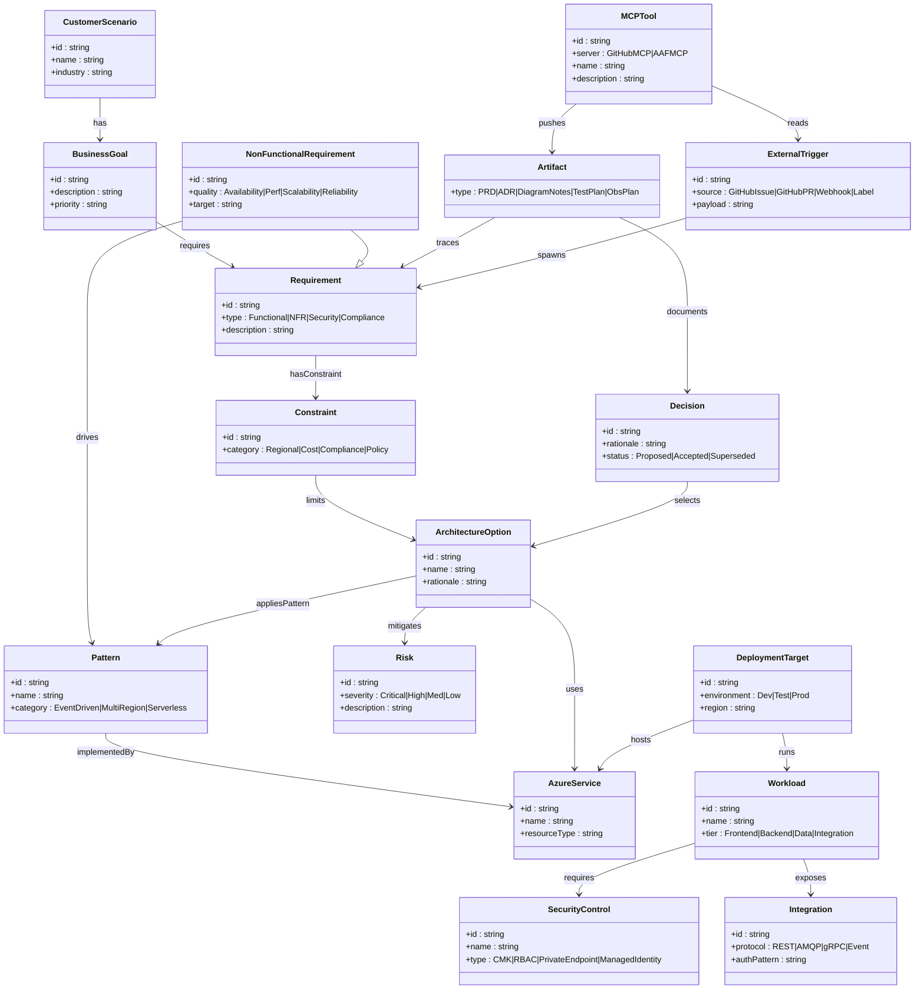
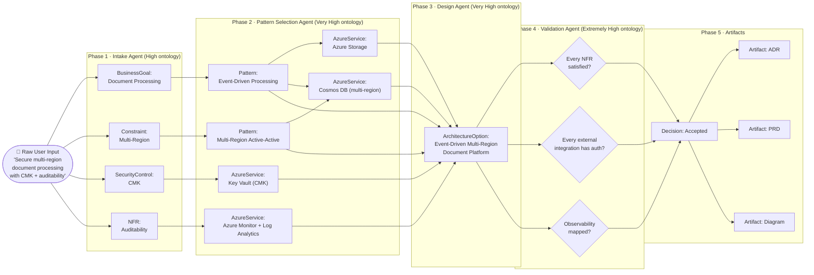
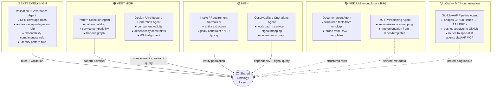
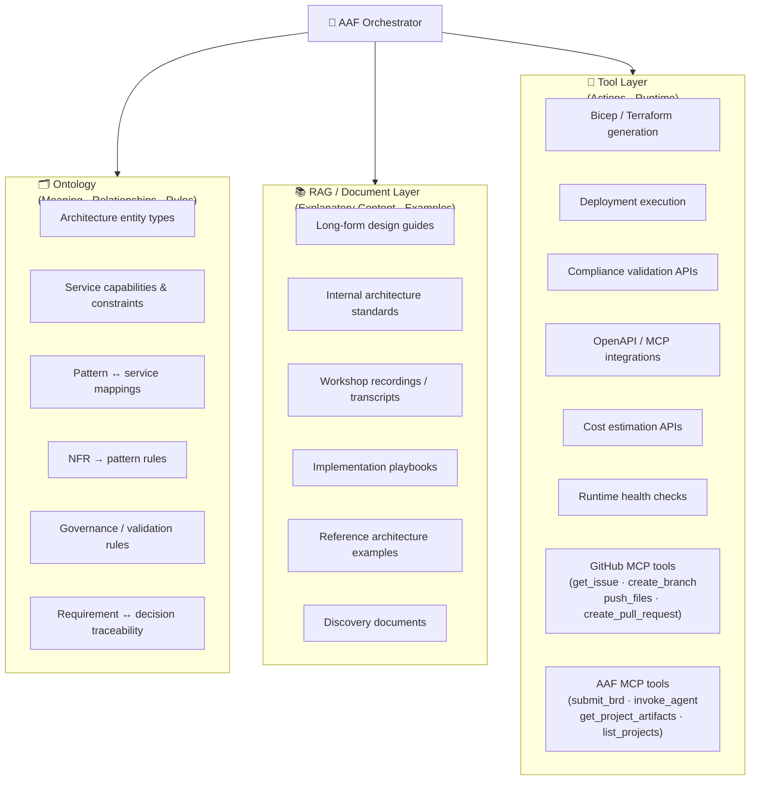

# AAF Ontology — Mermaid Diagrams

## Diagram 1 — Multi-Agent Architecture: Where Ontology Sits

```mermaid
graph TD
    User["👤 User / CSA / Portal"]
    Orchestrator["🧠 AAF Orchestrator\n(Parent Agent)"]

    subgraph Agents["Specialized Agents"]
        A1["📥 Intake /\nRequirement Normalizer"]
        A2["🔍 Pattern\nSelection"]
        A3["🏗️ Design /\nArchitecture Generation"]
        A4["✅ Validation /\nGovernance"]
        A5["📄 Documentation"]
        A6["⚙️ IaC /\nProvisioning"]
        A7["📡 Observability /\nOperations"]
        A8["🐙 GitHub-AAF\nPipeline Agent"]
    end

    subgraph SharedContext["Shared Context Layer"]
        Ontology["🗂️ Ontology\n(Semantic Backbone)\nEntities · Relationships · Rules"]
    end

    subgraph KnowledgeLayer["Knowledge Layer"]
        RAG["📚 RAG / Document Store\n(Standards, Examples,\nDesign Guides, Playbooks)"]
        Templates["📋 Templates &\nDocument Stores"]
    end

    subgraph ToolLayer["Tool Layer"]
        Tools["🔧 Tools / APIs\n(Deployment · Validation\nOpenAPI / MCP · Runtime)"]
        GitHubMCP["🐙 GitHub MCP Server\n(get_issue · create_branch\npush_files · create_pull_request\nadd_issue_comment)"]
        AAFMCP["🔌 AAF MCP Server\n(submit_brd · get_project_status\nget_project_artifacts · invoke_agent\nlist_projects)"]
    end

    User --> Orchestrator
    Orchestrator --> A1
    Orchestrator --> A2
    Orchestrator --> A3
    Orchestrator --> A4
    Orchestrator --> A5
    Orchestrator --> A6
    Orchestrator --> A7

    A1 -->|HIGH| Ontology
    A2 -->|VERY HIGH| Ontology
    A3 -->|VERY HIGH| Ontology
    A4 -->|EXTREMELY HIGH| Ontology
    A7 -->|HIGH| Ontology
    A5 -.->|MEDIUM| Ontology
    A6 -.->|MEDIUM| Ontology
    A8 -.->|LOW| Ontology

    A5 --> RAG
    A5 --> Templates
    A4 --> Tools
    A6 --> Tools
    A8 --> GitHubMCP
    A8 --> AAFMCP

    classDef agentBox fill:#0078d4,color:#fff,stroke:#005a9e
    classDef ontoBox fill:#107c10,color:#fff,stroke:#004b00
    classDef ragBox fill:#8764b8,color:#fff,stroke:#5c2d91
    classDef toolBox fill:#d83b01,color:#fff,stroke:#a80000
    classDef mcpBox fill:#e3008c,color:#fff,stroke:#a40062
    classDef userBox fill:#323130,color:#fff,stroke:#000
    classDef orchBox fill:#004e8c,color:#fff,stroke:#003966

    class A1,A2,A3,A4,A5,A6,A7,A8 agentBox
    class Ontology ontoBox
    class RAG,Templates ragBox
    class Tools toolBox
    class GitHubMCP,AAFMCP mcpBox
    class User userBox
    class Orchestrator orchBox
```

---

## Diagram 2 — Core Ontology Entity Model (Phase 1: Six-Domain Starter)

---

## Diagram 3 — Extended Ontology Entity Model (Full Domain)

---

## Diagram 4 — Requirement → Architecture Traceability Flow

---

## Diagram 5 — Ontology Usage Heat Map by Agent Role

---

## Diagram 6 — What Belongs Where (Ontology vs RAG vs Tools)

---

> **One-sentence framing:**  
> *"In AAF, ontology is the shared architecture knowledge model that lets every agent interpret requirements, patterns, services, and decisions consistently, while RAG and tools handle unstructured guidance and execution."*
