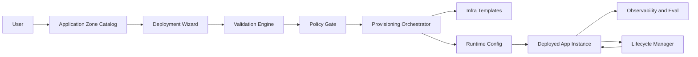

# AAF Application Zone Technical Blueprint

## 1. Purpose
Define the technical architecture, contracts, APIs, and delivery plan for adding an Application Zone to AAF that supports pre-implemented application packs such as CaseWright.

## 2. Design Principles
- Secure by default (managed identity, Key Vault, policy gates)
- Contract-first packaging (versioned App Pack schema)
- Reproducible deployment (deterministic infra and runtime profiles)
- Observable by default (health, traces, eval signals)
- Safe lifecycle management (upgrade prechecks, rollback support)

## 3. System Context
### 3.1 Logical Components
- Application Zone UI: catalog, deployment wizard, instance operations views
- App Pack Registry: validated package metadata and versions
- Validation Engine: input validation and policy checks
- Provisioning Orchestrator: invokes AAF deployment orchestration
- Runtime Integrations: Foundry/agent runtime, data sources, channel adapters
- Operations Plane: health aggregation, upgrade orchestration, rollback coordination

### 3.2 Component Flow


## 4. App Pack Contract
### 4.1 Versioning
- Semantic versioning required: MAJOR.MINOR.PATCH
- Breaking changes require MAJOR bump
- App instances can pin or follow latest compatible MINOR/PATCH

### 4.2 Canonical Schema (v1)
```json
{
  "apiVersion": "aaf.applicationzone/v1",
  "kind": "AppPack",
  "metadata": {
    "packId": "casewright",
    "displayName": "CaseWright",
    "version": "1.0.0",
    "owner": "aaf-core",
    "supportTier": "standard",
    "status": "preview"
  },
  "compatibility": {
    "minimumAAFVersion": "0.9.0",
    "supportedRegions": ["eastus", "westeurope"],
    "requiredServices": ["azure-openai", "key-vault", "application-insights"]
  },
  "inputs": {
    "required": [
      { "name": "environmentName", "type": "string" },
      { "name": "region", "type": "enum" },
      { "name": "identityMode", "type": "enum" },
      { "name": "documentSource", "type": "object" },
      { "name": "modelProfile", "type": "enum" }
    ],
    "optional": [
      { "name": "channelMode", "type": "enum" },
      { "name": "retentionDays", "type": "integer" }
    ]
  },
  "deployment": {
    "runtimeProfiles": ["dev", "test", "prod"],
    "infraEntryPoint": "infra/main.bicep",
    "defaultProfile": "dev"
  },
  "security": {
    "managedIdentityRequired": true,
    "keyVaultRequired": true,
    "requiredPolicies": ["rbac-least-privilege", "diagnostic-logs-enabled"]
  },
  "operations": {
    "healthChecks": ["/health", "/health/ready"],
    "sloTargets": {
      "availability": "99.9%",
      "p95LatencyMs": 2000
    }
  },
  "lifecycle": {
    "upgradeStrategy": "precheck-then-roll",
    "rollbackSupported": true
  },
  "verification": {
    "smokeTests": ["tests/smoke/test_instance_up.py"],
    "evaluationPlan": "evals/starter-eval-plan.json"
  }
}
```

## 5. Data Model
### 5.1 Core Entities
- AppPack: immutable pack artifact + metadata per version
- AppInstance: deployed instance linked to pack version and environment
- DeploymentRun: execution record with stage-by-stage status
- PolicyCheckResult: pre-deploy and post-deploy rule outcomes
- UpgradeRun: upgrade attempt, compatibility checks, rollback state

### 5.2 State Model (Instance)
- Draft
- Validating
- Provisioning
- Healthy
- Degraded
- Upgrading
- RollbackInProgress
- Failed

## 6. API Contract (Internal AAF Endpoints)
### 6.1 Catalog
- GET /api/application-zone/packs
- GET /api/application-zone/packs/{packId}/versions
- GET /api/application-zone/packs/{packId}/versions/{version}

### 6.2 Validation
- POST /api/application-zone/validate-inputs
- POST /api/application-zone/policy/precheck

### 6.3 Provisioning
- POST /api/application-zone/instances
- GET /api/application-zone/instances/{instanceId}
- GET /api/application-zone/instances/{instanceId}/runs

### 6.4 Lifecycle
- POST /api/application-zone/instances/{instanceId}/upgrade
- POST /api/application-zone/instances/{instanceId}/rollback
- GET /api/application-zone/instances/{instanceId}/health

### 6.5 Example Request
```json
{
  "packId": "casewright",
  "version": "1.0.0",
  "profile": "prod",
  "inputs": {
    "environmentName": "legal-prod-us",
    "region": "eastus",
    "identityMode": "system-assigned",
    "documentSource": {
      "type": "blob",
      "resourceId": "/subscriptions/.../storageAccounts/..."
    },
    "modelProfile": "balanced",
    "channelMode": "teams"
  }
}
```

## 7. Security and Compliance Baseline
- Enforce managed identity; reject secret-based auth except approved break-glass mode
- Resolve secrets from Key Vault only
- RBAC templates scoped to minimum required actions
- Diagnostic logs and traces required before healthy state is declared
- Immutable audit trail for deployment, policy, upgrade, and rollback actions

## 8. Observability and Evaluation
- Required signals:
  - Platform: deployment duration, failures by stage, policy gate failures
  - Runtime: request count, p95 latency, error rate, availability
  - Quality: evaluation pass rate, grounding/retrieval quality where applicable
- Dashboard packs:
  - Application Zone Ops
  - Pack Runtime Health
  - Upgrade and Rollback Outcomes

## 9. CaseWright Reference App Pack
### 9.1 Required Inputs
- jurisdictionProfile
- documentSource
- identityMode
- modelProfile

### 9.2 Optional Inputs
- channelMode (teams/web)
- retentionDays
- strictCitationMode

### 9.3 Preflight Rules
- Document source connectivity test must pass
- Required policy assignments present
- Minimum model quota in target region

## 10. Delivery Plan
### Phase A (Weeks 1-4)
- App Pack schema validator
- Catalog API and UI list view
- CaseWright v1 pack ingestion
- Input validator + policy precheck endpoint

### Phase B (Weeks 5-8)
- Instance provisioning orchestration endpoint
- Run status tracking and event model
- Health and operations views
- Starter observability dashboard and smoke tests

### Phase C (Weeks 9-12)
- Upgrade and rollback orchestration
- Compatibility checks for pack updates
- Pilot hardening, runbook, and support handoff

## 11. Testing Strategy
- Unit: schema validation, input rules, policy evaluation logic
- Integration: pack deploy path, policy gate path, health aggregation
- End-to-end: catalog selection to healthy instance deployment
- Reliability: rollback validation and idempotent retry behavior

## 12. Open Decisions
- App Pack artifact storage backend (git-based registry vs object storage + metadata DB)
- Compatibility contract granularity (AAF API-level only vs infra module-level lock)
- Tenant isolation model for shared control plane deployments

## 13. Recommended Next Actions
- Ratify the App Pack v1 schema and API list
- Implement CaseWright as the first certified pack
- Run a 2-team pilot with success criteria from the product brief
