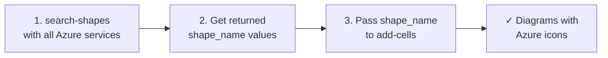

# Azure Icon Implementation Guide

## Overview
All architecture diagrams in the Azure Architecture Factory must use official Azure icons instead of generic rectangles. This ensures consistency, professional appearance, and better communication of the technical architecture.

## What Changed

### 1. Agent Instructions Updated
The following agent files have been updated to REQUIRE Azure icons:

- **`.github/agents/brd-to-architecture-diagram.agent.md`**
  - Added explicit constraint: "REQUIRE Azure icons: Every vertex representing an Azure service MUST use a `shape_name` from `search-shapes`"
  - Updated Step 3d to clarify: "Use `shape_name` for ALL Azure service vertices — NO generic `rounded=1;whiteSpace=wrap` rectangles"

- **`.github/agents/project-orchestrator.agent.md`**
  - Added requirement to Phase 1 Mode A: "REQUIRE Azure icons: Call `search-shapes` to identify exact shape names, then pass `shape_name` for every Azure service vertex"
  - Emphasized sequencing to ensure icons are applied

### 2. Icon Sources Documentation Enhanced
**`docs/ICON_SOURCES.md`** now includes:

- **NEW Section 0**: "⚠️ REQUIREMENT: Azure Icons in All New Diagrams"
  - Explicit requirement that all new diagrams MUST use Azure icons
  - Clear examples of correct usage vs. incorrect usage
  - Emphasizes use of `shape_name` in add-cells calls

## How to Use Azure Icons

### For New Diagram Generation (Using MCP Draw.io Agent)

When calling `brd-to-architecture-diagram` or when `project-orchestrator` generates a Phase 1 diagram:



**Example workflow:**

1. **Search for shapes:**
   ```json
   {
     "queries": ["Container Apps", "Cosmos DB", "Key Vault", "AI Search"]
   }
   ```

2. **Use returned shape names in add-cells:**
   ```json
   {
     "cells": [
       {
         "shape_name": "Container Apps",
         "text": "API Service",
         "x": 200,
         "y": 100,
         "temp_id": "api"
       },
       {
         "shape_name": "Cosmos DB",
         "text": "Document Store",
         "x": 500,
         "y": 100,
         "temp_id": "cosmos"
       }
     ]
   }
   ```

3. **Result:** Both services render with official Azure icons, not generic boxes.

### For Existing Diagrams (Manual Updates)

See `docs/ICON_SOURCES.md` Section 4 for two options:

**Option A (Recommended): Use Draw.io MCP Agent**
- Use `set-cell-shape` to swap rectangles for Azure icons
- Automatic resolution from built-in library

**Option B: Direct XML Edit**
- Replace `style` attribute with `shape=image` + CDN URL
- Example:
  ```xml
  style="shape=image;
         image=https://learn.microsoft.com/en-us/azure/architecture/media/icons/Compute/azure-container-apps.svg;
         imageWidth=80;imageHeight=80;
         verticalLabelPosition=bottom;labelPosition=center;rounded=1;html=1;"
  ```

## Diagrams Needing Icon Updates

The following diagrams currently use generic rectangles and should be updated:

1. `diagrams/azure-ai-foundry-architecture.drawio` — All services use plain rectangles
2. `diagrams/fabric-lakehouse-architecture.drawio` — All services use plain rectangles
3. Various project-generated diagrams that may have been created before this requirement

See `docs/ICON_SOURCES.md` Section 2 for specific cell-by-cell mappings.

## Icon Sources

- **Primary (Recommended)**: Draw.io MCP Server built-in Azure library
- **Fallback**: Microsoft Azure Architecture Icons CDN
  - Base URL: `https://learn.microsoft.com/en-us/azure/architecture/media/icons/{Category}/{service-name}.svg`
  - Full catalog: https://learn.microsoft.com/en-us/azure/architecture/icons/
  - Bulk download: https://aka.ms/azureicons

## Quality Checklist for Diagrams

Before committing a new diagram, verify:

- ✅ All Azure services use `shape_name` (not generic rectangles)
- ✅ No cells contain `rounded=1;whiteSpace=wrap;html=1;fillColor=...` for Azure services
- ✅ Companion `.md` notes are clear and complete
- ✅ Diagram follows left-to-right flow with cross-cutting services at bottom
- ✅ Labels are concise and service types are clear

## Questions or Issues?

Refer to:
1. `docs/ICON_SOURCES.md` — Comprehensive icon reference and how-to
2. `.github/agents/brd-to-architecture-diagram.agent.md` — Agent workflow and constraints
3. `.github/agents/project-orchestrator.agent.md` — Phase 1 diagram generation requirements
4. MCP Draw.io documentation — For technical details on `search-shapes` and `add-cells`
