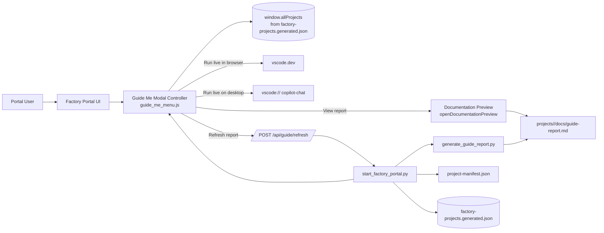
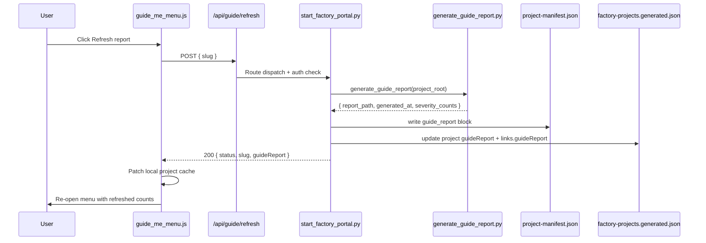

# Guide Me Architecture - Component and Flow Detail

This document describes the detailed runtime architecture behind the portal Guide Me experience, including component responsibilities, request/response contracts, and the three execution paths (report-only, vscode.dev, VS Code desktop).

Related artifacts:

1. `../diagrams/guide-me-detailed-architecture.drawio`
2. `../diagrams/guide-me-detailed-architecture.md`

The drawio file includes three pages:

1. Logical component topology
2. Primary success-path sequences
3. Failure-path and fallback sequences

## 1. Architecture Scope

The architecture covers:

1. Frontend interaction from the project card Guide Me link.
2. Static report rendering path for portal-only users.
3. Live guidance launch paths for vscode.dev and VS Code Desktop users.
4. Report refresh path that regenerates findings and updates project metadata.

Out of scope:

1. Internal implementation details of the `factory-workflow-guide` agent itself.
2. BRD intake pipeline internals not directly used by Guide Me.

## 2. Component Inventory

| Component | Location | Responsibility | Key Inputs | Key Outputs |
|---|---|---|---|---|
| Guide Me entry action | `factory-portal.html` project card | Captures user click and delegates to menu launcher | Project slug, click event | Opens Guide Me modal |
| Delegation shim | `factory-portal.html` `openWorkflowGuideInCopilot` | Routes to new tiered menu; preserves legacy fallback safety | Slug | Calls `window.openGuideMeMenu` |
| Guide Me modal controller | `scripts/portal/guide_me_menu.js` | Builds UI, resolves report availability, handles button actions | Slug, `window.allProjects` feed data | Modal UI actions and navigation |
| Project feed cache | `factory-projects.generated.json` loaded into `window.allProjects` | Stores project metadata and optional `guideReport` block | Generated project metadata | Report path, generated timestamp, severity counts |
| Documentation preview renderer | `factory-portal.html` `openDocumentationPreview` | Fetches markdown and renders HTML via `marked` | Relative doc path | Rendered documentation modal |
| Guide report generator | `scripts/generate_guide_report.py` | Scans project state and writes deterministic findings | Project root path | `docs/guide-report.md` + severity summary |
| Guide refresh API endpoint | `scripts/start_factory_portal.py` `/api/guide/refresh` | Auth-protected mutation endpoint to regenerate report and patch metadata | JSON body with slug | Updated manifest/feed and API JSON response |
| Project manifest | `projects/<slug>/project-manifest.json` | Per-project metadata source of truth | Generated/updated fields | `guide_report` block |

## 3. High-Level Component Topology



## 4. End-to-End Flow Detail

## 4.1 Shared Entry Flow

1. User clicks Guide Me from a project card.
2. `openWorkflowGuideInCopilot(slug, evt)` executes in `factory-portal.html`.
3. Delegation logic checks for `window.openGuideMeMenu`.
4. `openGuideMeMenu` resolves project metadata from `window.allProjects`.
5. If `guideReport` is missing in feed metadata, it probes `projects/<slug>/docs/guide-report.md` with a `HEAD` request.
6. Modal is rendered with up to four actions:
   1. View report.
   2. Run live guide in vscode.dev.
   3. Run live guide in VS Code Desktop.
   4. Refresh report.

## 4.2 Flow A - Report-Only (Portal-Only User)

1. User selects View report.
2. UI calls `openDocumentationPreview(reportPath, title)`.
3. Portal fetches markdown file.
4. `renderMarkdownPreview` detects `.md` and renders with `marked.parse`.
5. User sees formatted report in modal without Copilot dependency.

Design purpose:

1. Ensure guidance is available even where VS Code/Copilot cannot be used.
2. Keep behavior deterministic and low-friction.

## 4.3 Flow B - Live Guide in vscode.dev

1. User selects Run live guide in vscode.dev.
2. Client builds a workflow prompt including project slug and intent.
3. Prompt is copied to clipboard.
4. Browser opens repository in `https://vscode.dev/github/<owner>/<repo>`.
5. User pastes prompt into Copilot Chat agent mode.
6. `factory-workflow-guide` runs against current repo state and returns real-time guidance.

## 4.4 Flow C - Live Guide in VS Code Desktop

1. User selects Run live guide in VS Code Desktop.
2. Client builds the same workflow prompt.
3. Prompt is copied to clipboard.
4. Browser opens `vscode://GitHub.copilot-chat/chat?query=<encoded prompt>`.
5. Desktop VS Code opens Copilot Chat with prefilled query.
6. User executes prompt and receives live guidance.

## 4.5 Flow D - Report Refresh Mutation



## 5. Data Contracts

## 5.1 Feed and Manifest Shape

Expected structure for `guideReport`:

```json
{
  "path": "projects/<slug>/docs/guide-report.md",
  "generated_at": "2026-04-16T12:34:56Z",
  "severity_counts": {
    "critical": 0,
    "warning": 2,
    "advisory": 1,
    "ok": 4
  }
}
```

Manifest key: `guide_report`

Feed key: `guideReport`

## 5.2 Refresh API Request/Response

Request:

```json
{
  "slug": "field-service-intelligence-platform-20260415212450"
}
```

Successful response:

```json
{
  "status": "ok",
  "slug": "field-service-intelligence-platform-20260415212450",
  "guideReport": {
    "path": "projects/field-service-intelligence-platform-20260415212450/docs/guide-report.md",
    "generated_at": "2026-04-16T12:34:56Z",
    "severity_counts": {
      "critical": 5,
      "warning": 2,
      "advisory": 1,
      "ok": 1
    }
  }
}
```

Failure modes:

1. `400` invalid JSON payload.
2. `404` unknown slug or invalid project path.
3. `500` report generation failure.

## 6. Auth and Security Controls

Mutation protection for refresh:

1. `/api/guide/refresh` requires `_require_auth_for_mutation()`.
2. Auth accepts portal token/API key or local dev bypass depending on server mode.
3. Slug validation protects against traversal by regex plus project-root boundary check.
4. Updated files are constrained to project manifest and top-level generated feed.

## 7. Reliability and UX Behavior

1. If feed lacks `guideReport`, UI still attempts fallback by probing report file existence.
2. Refresh button has loading state and disables itself while request is in-flight.
3. On success, local cache is patched before modal re-open to avoid stale view.
4. On failure, error toast is shown and current modal state remains available.

## 8. Operational Notes

1. Report generation is deterministic and file-state-based, making output reproducible.
2. Backfill script can seed all historical projects so report view is immediately available.
3. Refresh allows drift correction after manual changes or additional generated artifacts.

## 9. Suggested Future Enhancements

1. Add refresh request latency and failure metrics to portal diagnostics.
2. Add ETag or hash to skip unchanged report rewrites.
3. Add per-finding deep links from report to specific project files.
4. Add background refresh queue for large project sets.
