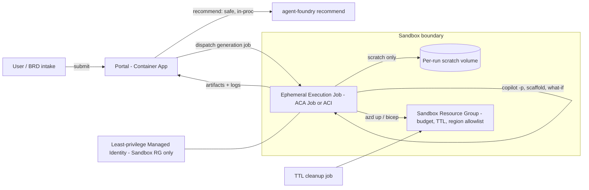

# Architecture Factory — Sandbox Design

Status: **Draft for review** · Owner: TBD · Last updated: 2026-07-12

This document proposes an execution/deployment **sandbox** for the Azure Architecture Factory portal. It defines the boundary and a phased plan so we agree on scope before writing code.

## 1. Why a sandbox

The portal turns a Business Requirements Document into a running Azure solution. Most of the portal is safe, but two steps carry real risk:

- **Generation / iteration** spawns the **GitHub Copilot CLI** (`copilot -p`) as background tasks that write files and run commands derived from AI‑generated BRDs — i.e. it executes semi‑trusted, machine‑generated work.
- **Deployment** (`azd up` / Bicep) can create **real Azure resources** with real cost and real blast radius.

By contrast, the **Analyze with AI Agent Foundry** step (`/api/agent-foundry/recommend`) is a deterministic keyword scorer — read‑only, no LLM, no side effects — and is **out of scope** for sandboxing.

### Risks to contain
| Risk | Today | With sandbox |
|---|---|---|
| Generated code touches host FS / other projects | Runs in the portal container with host mounts | Ephemeral, no host mounts |
| Deploys hit shared/prod infra | Uses portal identity against a dev RG | Scoped to a dedicated sandbox RG only |
| Runaway cost | No hard cap | Budget cap + TTL cleanup |
| One user affects another | Shared runtime | Per‑project isolation |
| Excess privilege on bad deploy | Portal identity | Least‑privilege managed identity |

## 2. What already exists (partial isolation)

- Portal runs as a **non‑root** user in a container (`Dockerfile.portal`).
- Generated projects are isolated on disk under `projects/<slug>/`.
- BRD intake is gated by **EasyAuth + a BRD allowlist**.
- Deploy target today is a single dev resource group (`arch-factory-dev-rg`).

**Gap:** the Copilot runtime and deploy actions still execute **inside the portal container**, with the **portal's identity** and **host filesystem** — that is the boundary the sandbox closes.

## 3. Target architecture

### Key elements
1. **Execution isolation (highest value).** Run each generation/Copilot run in an **ephemeral Container Apps Job** (or ACI) — one per project/run — with:
   - **no host mounts** (scratch volume only, discarded after the run),
   - **restricted egress** (allow Azure control plane + package registries; deny the rest),
   - **CPU / memory / wall‑clock limits**, and non‑root.
2. **Dedicated Azure target.** A **sandbox resource group** (or subscription if compliance requires) that:
   - carries a **budget with an alert + hard spend guard**,
   - enforces a **region allowlist** and **denies expensive SKUs** (Azure Policy),
   - has **TTL auto‑cleanup** on generated resources (tag `expiresOn`, scheduled purge).
3. **Least‑privilege identity.** A **managed identity scoped only to the sandbox RG** (Contributor on that RG, nothing broader). The portal never hands its own identity to generated code.
4. **Safety guardrails.** Default to **`what-if` / dry‑run** before any real `azd up`; require an explicit confirm to promote a run from dry‑run to real deploy.

## 4. Phased plan

**Phase 1 — Execution isolation + bounded target (recommended first).**
- Move generation/Copilot runs into an **ephemeral ACA Job** with no host mounts, egress limits, and time/resource caps.
- Point deploys at a **dedicated sandbox RG** with a **budget cap** and **TTL cleanup** (tag + scheduled purge).
- Skip a separate subscription for now.

**Phase 2 — Identity + policy hardening.**
- Introduce the **sandbox‑scoped managed identity**; remove deploy rights from the portal identity.
- Add **Azure Policy** (region allowlist, SKU denylist, require tags).

**Phase 3 — Multi‑tenant + compliance (if needed).**
- Per‑user quotas and concurrency limits.
- Optional dedicated **sandbox subscription** for hard billing/compliance isolation.
- `what-if`‑gated promotion to a separate non‑sandbox target.

## 5. Open decisions
- **Execution host:** Container Apps **Job** vs **ACI** vs Kubernetes Job? (Leaning ACA Job — same platform as the portal, easy identity + scaling.)
- **Sandbox scope:** dedicated **RG** (fast) vs dedicated **subscription** (stronger isolation, more setup).
- **Egress policy:** allowlist targets for Copilot CLI + package managers.
- **TTL default:** e.g. auto‑purge sandbox resources after 24–72h.
- **Cost cap behavior:** alert‑only vs hard stop on budget breach.

## 6. Non‑goals
- Sandboxing the recommendation/analyze step (already safe).
- Changing the portal's read‑only browsing, catalogs, or docs.
