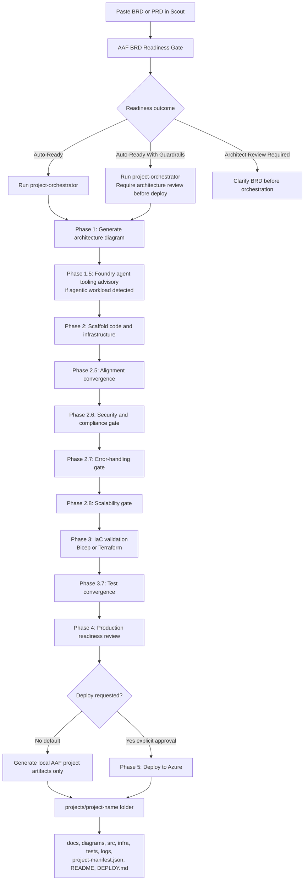

# Using Azure Architecture Factory Through Scout

This guide helps a new Microsoft Scout user run Azure Architecture Factory (AAF) workflows from Scout.

## 1. Install and open Scout

Install Microsoft Scout, then open a new Scout chat session.

## 2. Clone or locate the AAF repo

Use this recommended local path:

```powershell
C:\workspace\azure-architecture-factory
```

If the repo is somewhere else, tell Scout the path:

```text
Use C:\workspace\azure-architecture-factory as the AAF repo.
```

## 3. Add the AAF skill to Scout

Ask Scout:

```text
Add AAF as a Scout skill using the Azure Architecture Factory repo README, docs, and .github agents.
```

The skill should reference these live repo resources:

```text
README.md
docs\**
.github\README.md
.github\copilot-instructions.md
.github\agents\*.agent.md
.github\workflows\*
```

## 4. Use AAF through Scout

You can ask Scout naturally:

```text
Help me run a new BRD through AAF.
```

If the slash command is available in your Scout session, you can also use:

```text
/aaf help
```

If `/aaf` is not recognized, paste the request normally. Scout can still use the AAF repo guidance directly.

## 5. Run a BRD or PRD

Paste the BRD or PRD into Scout and say:

```text
Run this through AAF with deploy: false.
```

Default safe options:

```text
deploy: false
runtime: auto
region: eastus
environment: dev
```

Scout should first classify the BRD or PRD using the AAF readiness gate, then run `project-orchestrator` only if appropriate.

## 6. BRD/PRD flow through Scout and AAF



## 7. Optional: run the local AAF portal

To run the deployed-style portal locally:

```powershell
cd C:\workspace\azure-architecture-factory
.\.venv\Scripts\python.exe -X utf8 scripts\start_factory_portal.py
```

Then open:

```text
http://127.0.0.1:5501/
```

## 8. Expected output

AAF-generated projects land under:

```text
projects\<project-name>\
  docs\
  diagrams\
  src\
  infra\
  tests\
  logs\
  project-manifest.json
  README.md
  DEPLOY.md
```

## 9. Safety rule

Scout should not deploy Azure resources unless the user explicitly asks for deployment and confirms it. Use `deploy: false` for normal BRD or PRD generation.
