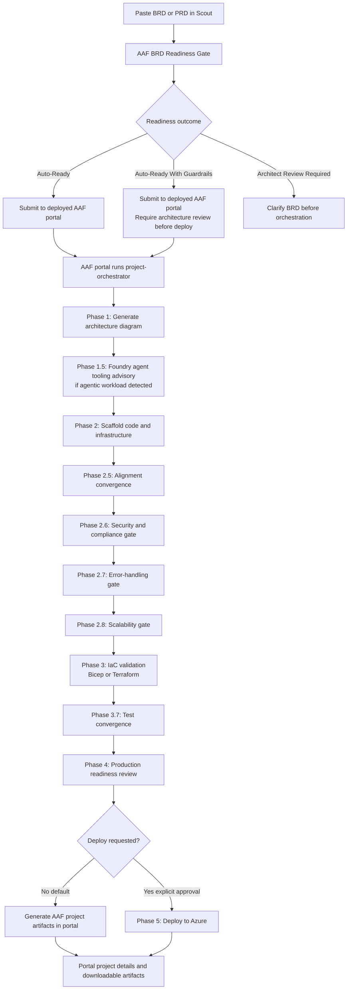

# Using Azure Architecture Factory Through Scout

This guide helps a new Microsoft Scout user run Azure Architecture Factory (AAF) workflows from Scout.

## 1. Install and open Scout

Install Microsoft Scout, then open a new Scout chat session.

## 2. Use the deployed AAF portal

Use the deployed AAF portal as the primary AAF experience:

```text
https://arch-factory-dev-portal.politebeach-70e24eed.eastus.azurecontainerapps.io/factory-portal.html
```

The deployed portal may require Microsoft sign-in. If Scout needs to interact with it, use a browser-backed Scout flow so the user can complete sign-in.

## 3. Optional local repo fallback

The AAF repo is still useful for reference docs, local troubleshooting, and offline development. Use this recommended local path only when the deployed portal is unavailable or when you need to inspect implementation details:

```powershell
C:\workspace\azure-architecture-factory
```

If the repo is somewhere else, tell Scout:

```text
Use C:\workspace\azure-architecture-factory as the AAF repo.
```

## 4. Add the AAF skill to Scout

Ask Scout:

```text
Add AAF as a Scout skill using the deployed AAF portal as the primary interface and the Azure Architecture Factory repo README, docs, and .github agents as fallback reference.
```

The skill should prefer:

```text
https://arch-factory-dev-portal.politebeach-70e24eed.eastus.azurecontainerapps.io/factory-portal.html
```

The skill can also reference these repo resources when local implementation guidance is needed:

```text
README.md
docs\**
.github\README.md
.github\copilot-instructions.md
.github\agents\*.agent.md
.github\workflows\*
```

## 5. Use AAF through Scout

You can ask Scout naturally:

```text
Help me run a new BRD through AAF.
```

If the slash command is available in your Scout session, you can also use:

```text
/aaf help
```

If `/aaf` is not recognized, paste the request normally. Scout can still use the deployed AAF portal and fall back to repo guidance when needed.

### AAF Scout command catalog

For direct feature access, create or use these Scout skills as slash commands:

| Command | Use when |
| --- | --- |
| `/aaf-help` | Show available AAF commands and route to the right workflow. |
| `/aaf-review-brd` | Classify a pasted or referenced BRD/PRD with the AAF readiness gate. |
| `/aaf-run-brd` | Run a new BRD/PRD through the deployed AAF portal, with `deploy: false` unless explicitly requested. |
| `/aaf-portal` | Open, sign in to, or troubleshoot the deployed AAF portal; use local portal only as fallback. |
| `/aaf-project-status` | Inspect a deployed portal project when accessible, or a local `projects\<slug>` fallback folder. |
| `/aaf-update-project` | Apply new BRD/change text to an existing AAF-generated project. |
| `/aaf-modernize` | Assess a legacy app and route it into AAF modernization guidance. |
| `/aaf-validate` | Validate generated artifacts: IaC, tests, readiness, observability, cost, or traceability. |
| `/aaf-deploy` | Deploy a prepared AAF project only after explicit user confirmation. |

If Scout does not recognize a newly-created slash command immediately, start a new Scout session or ask naturally with the command name in the message, for example:

```text
Use aaf-run-brd for this BRD with deploy: false.
```

## 6. Run a BRD or PRD

Paste the BRD or PRD into Scout and say:

```text
Run this through the deployed AAF portal with deploy: false.
```

Default safe options:

```text
deploy: false
runtime: auto
region: eastus
environment: dev
```

Scout should first classify the BRD or PRD using the AAF readiness gate, then submit it to the deployed AAF portal only if appropriate.

## 7. BRD/PRD flow through Scout and AAF



## 8. Optional: run the local AAF portal

Use the local portal only when the deployed portal is unavailable or when you need local development/debugging.

To run the deployed-style portal locally:

```powershell
cd C:\workspace\azure-architecture-factory
.\.venv\Scripts\python.exe -X utf8 scripts\start_factory_portal.py
```

Then open:

```text
http://127.0.0.1:5501/
```

## 9. Expected output

In the deployed portal, AAF-generated projects appear as portal project records with generated architecture, docs, source, infrastructure, tests, logs, and downloadable artifacts.

For local fallback runs, generated projects land under:

```text
projects\<project-name>\
  docs\
  diagrams\
  src\
  infra\
  tests\
  logs\
  project-manifest.json
  README.md
  DEPLOY.md
```

## 10. Safety rule

Scout should not deploy Azure resources unless the user explicitly asks for deployment and confirms it. Use `deploy: false` for normal BRD or PRD generation.
