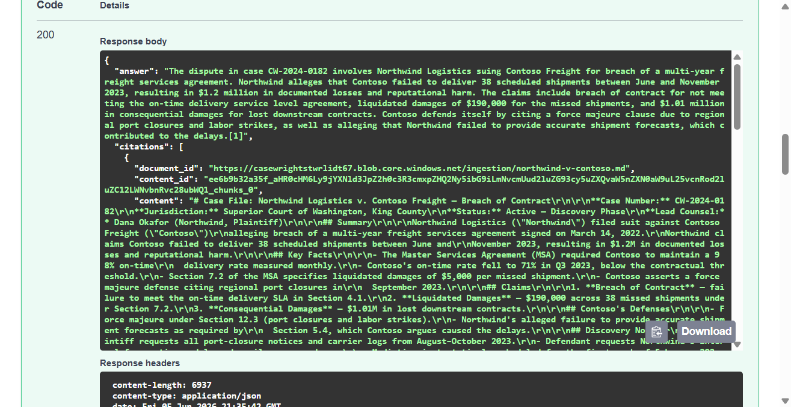
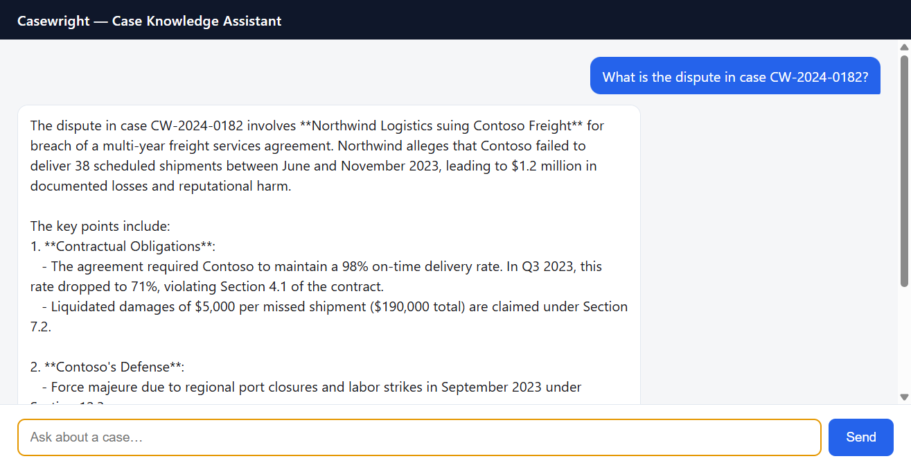
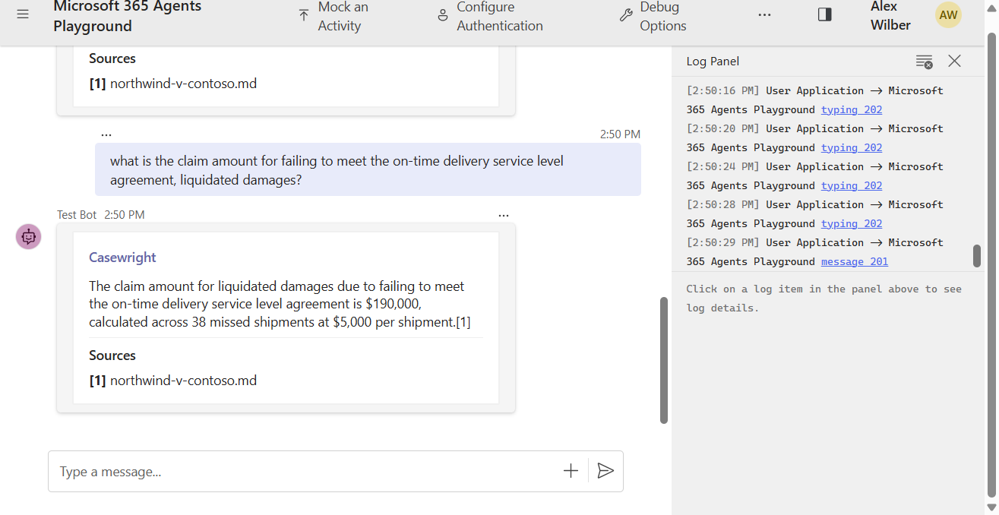

# Casewright — A Parallel Learning Build of the Case Assistant Agent

**From:** Fereydoun

## Summary

I built **Casewright** in parallel to the **Case Assistant Agent** project as a hands-on
learning exercise. The main purpose was not to ship a competing product, but to **understand
the design and the end-to-end process** by rebuilding a system with the same core capabilities
from the ground up.

By implementing it independently, I was able to internalize the *why* behind each architectural
decision rather than just reading the existing code.

## What Casewright does

It delivers the same capability set as the Case Assistant Agent:

- Grounded, agentic case Q&A with **inline citations**
- SharePoint document ingestion into **Azure AI Search**
- **Foundry IQ** retrieval over the indexed corpus
- **Cosmos DB**-backed chat history (hierarchical partition key)
- **React** web chat and **Microsoft Teams** frontends

## What I learned by rebuilding it

Building it myself forced me to reason through the trade-offs behind:

- **Event-driven sync** — Service Bus + a background worker instead of inline processing
- A **scheduler Function** for incremental SharePoint synchronization
- **Foundry IQ** as the retrieval layer, with a query fallback path
- **Identity-first security** — managed identities and RBAC over secrets
- **Infrastructure as Code** for the full stack

It also gave me room to explore **alternative design choices**, including:

- A **three-service split** (API / worker / scheduler) deployed by `azd`
- **Per-service managed identities** instead of a shared/broader identity
- **In-template RBAC** (`rbac.bicep`) instead of post-provision scripts
- **`dev` / `test` / `prod`** parameter sets via `.bicepparam`

A fuller, evidence-based architecture/design/operations comparison is in
[review-casewright-vs-case-assistant-agent.md](review-casewright-vs-case-assistant-agent.md),
and a step-by-step run guide is in
[demo-deployed-and-teams.md](demo-deployed-and-teams.md).

## End-to-end validation

I validated the system end-to-end in two ways.

### 1. Deployed to Azure and ran live grounded queries

The full stack is deployed and healthy. Querying the deployed API returns a grounded answer
with citations back to the source document — for example, case **CW-2024-0182**
(*Northwind Logistics v. Contoso Freight*):

The same query through the deployed **web chat UI** returns the grounded answer with a
**Sources** citation:

### 2. Tested the interactive Teams experience via the M365 Agents Playground

Pointing the Teams bot at the deployed backend, the **M365 Agents Playground** renders the
answer as an Adaptive Card with a **Sources** section — confirming the grounded, cited
experience works through the Teams channel:

## Next step

Happy to walk through a **live demo** — the deployed stack and the Playground setup are both
ready to show end to end.
