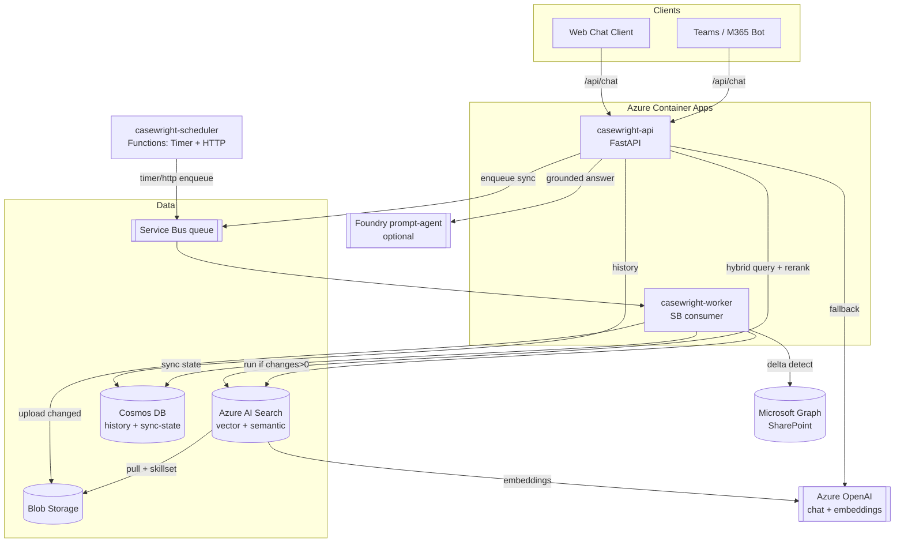
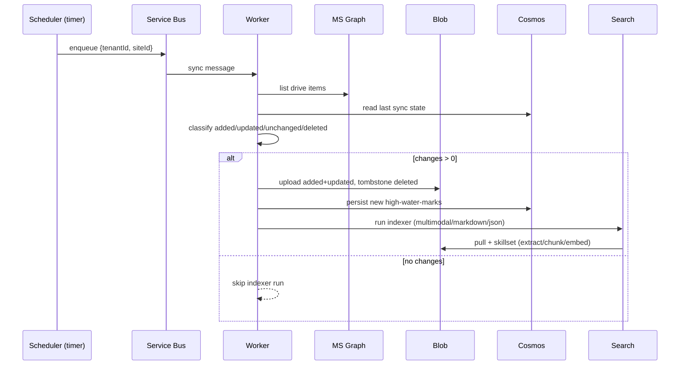

# Casewright — Architecture

> Draw.io MCP tools were not available during generation, so the architecture is rendered
> here in Mermaid (degraded Mode B). A `.drawio` can be regenerated later by re-running
> Phase 1 with the Draw.io MCP server connected.

## Component Inventory

| Component | Azure Service | Identity | Responsibility |
|-----------|---------------|----------|----------------|
| `casewright-api` | Container Apps | User-assigned MI | FastAPI: chat, pipeline, sharepoint, health |
| `casewright-worker` | Container Apps | User-assigned MI | Service Bus consumer → SharePoint sync → conditional indexer run |
| `casewright-scheduler` | Functions (Flex) | User-assigned MI | Timer + HTTP triggers → enqueue sync requests |
| Search | Azure AI Search | System MI | Vector + semantic index, skillsets, indexers |
| OpenAI | Azure OpenAI | — | Chat + embedding deployments |
| Blob | Storage Account | — | Ingestion landing zone + knowledge store |
| Cosmos | Cosmos DB (NoSQL) | — | Chat history (hierarchical PK) + sync state |
| Queue | Service Bus | — | Durable sync-request queue |
| Vault | Key Vault | — | Non-MI secrets (e.g. Graph app secret) |
| Insights | Application Insights | — | Telemetry |
| Foundry (optional) | Azure AI Foundry | — | Hosted prompt-agent runtime |

## System Diagram

## Data Flow — Ingestion

