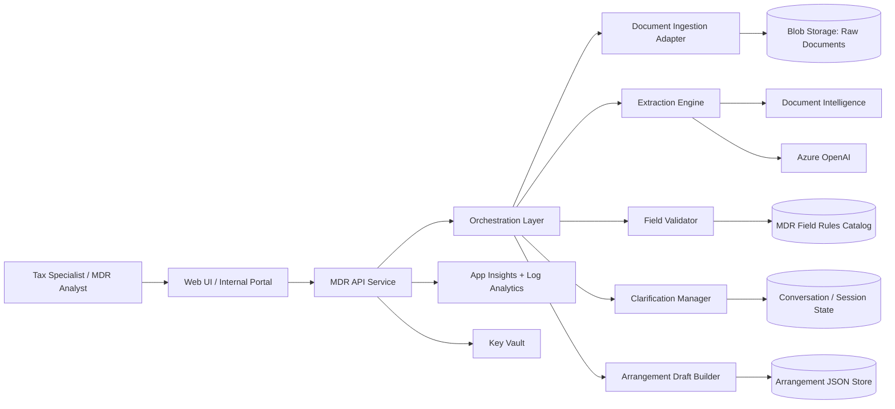
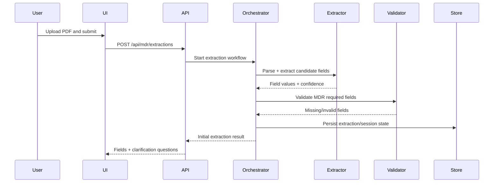
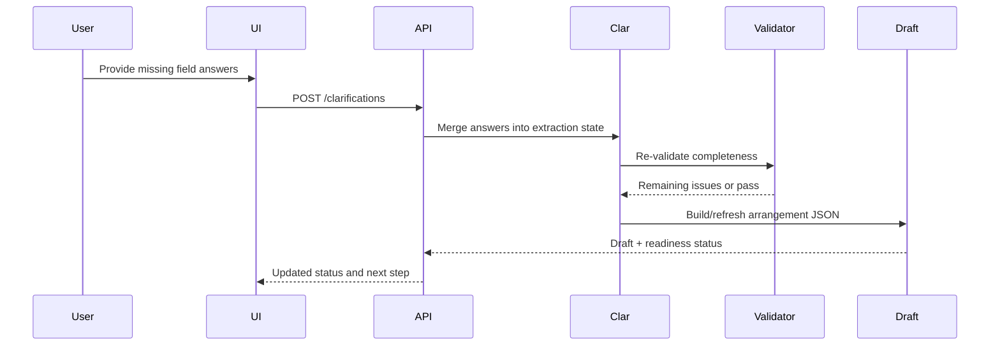

# MDR Support - Detailed Architecture

Related diagram artifacts:

1. `../diagrams/mdr-support-20260416174652-detailed-architecture.drawio`
2. `../diagrams/mdr-support-20260416174652-detailed-architecture.md`

## 1. Scope (Phase 1)

This architecture targets Phase 1 of MDR Support:

1. Ingest unstructured MDR source documents (PDF/text).
2. Extract structured arrangement fields into a normalized JSON contract.
3. Run a clarification loop for missing mandatory fields.
4. Produce a draft arrangement object for user review.

Out of scope (deferred):

1. Batch and multi-arrangement orchestration.
2. Full production-grade workflow orchestration.
3. Enterprise policy automation and advanced analytics.

## 2. Current Generated Baseline In This Project

Implemented starter components:

1. API service with health and ask endpoint: `src/copilot_api/main.py`
2. Request/response models: `src/copilot_api/models.py`
3. Stub response logic: `src/copilot_api/services/copilot_service.py`
4. Starter infrastructure shell: `infra/main.bicep`

Current API shape:

1. `GET /health`
2. `POST /api/copilot/ask`

Current behavior:

1. Returns deterministic placeholder responses.
2. Does not yet implement document extraction, validation, or clarification state.

## 3. Target Component Architecture (Detailed)

## 4. Logical Responsibilities Per Component

1. Web UI / Internal Portal:
1. Upload document and start extraction.
2. Display extracted fields and confidence.
3. Capture clarifications from user.

2. MDR API Service:
1. Expose APIs for upload, extract, clarify, and draft retrieval.
2. Enforce authentication/authorization.
3. Route requests to orchestration layer.

3. Orchestration Layer:
1. Coordinates extraction and validation stages.
2. Decides when clarification is required.
3. Maintains step status for each arrangement draft.

4. Document Ingestion Adapter:
1. Accept PDF/text payloads.
2. Normalize encoding and metadata.
3. Store original source content.

5. Extraction Engine:
1. OCR/structured extraction via Document Intelligence.
2. Semantic extraction and normalization via LLM.
3. Return candidate MDR fields + confidence score.

6. Field Validator:
1. Validate required MDR fields.
2. Check type/format/business-rule constraints.
3. Produce missing/invalid field list.

7. Clarification Manager:
1. Generate targeted follow-up questions for missing fields.
2. Persist conversational state and answers.
3. Merge clarifications back into field set.

8. Arrangement Draft Builder:
1. Build canonical MDR arrangement JSON.
2. Track completeness status (ready/pending).
3. Return final draft and audit metadata.

## 5. Phase 1 API Contract (Proposed)

1. `POST /api/mdr/extractions`
1. Input: file or text payload + tenant/case metadata.
2. Output: extraction job/session id + initial field set.

2. `GET /api/mdr/extractions/{id}`
1. Output: current extraction fields, confidence, and validation status.

3. `POST /api/mdr/extractions/{id}/clarifications`
1. Input: answers to missing-field prompts.
2. Output: updated validation status + remaining questions.

4. `GET /api/mdr/extractions/{id}/draft`
1. Output: canonical arrangement JSON draft + readiness flag.

## 6. End-to-End Flow (File Upload)

## 7. End-to-End Flow (Clarification Loop)

## 8. Data Model (Canonical Draft)

Core draft envelope:

1. `arrangementId`
2. `jurisdiction`
3. `taxpayerEntities[]`
4. `intermediaries[]`
5. `hallmarks[]`
6. `transactionTimeline[]`
7. `amountsAndCurrencies[]`
8. `supportingEvidence[]`
9. `completenessStatus`
10. `missingFields[]`
11. `audit` (source doc refs, extraction timestamps, user clarifications)

## 9. Security and Compliance Controls

1. Authentication via Entra ID / enterprise identity.
2. Authorization with role-based access (analyst, reviewer, admin).
3. Secrets in Key Vault; no credentials in code.
4. Data encryption at rest/in transit.
5. PII-sensitive logging policy with redaction.
6. Audit trail for extraction changes and clarifications.

## 10. Observability Plan

1. Request traces for each extraction session.
2. Metrics:
1. extraction latency
2. clarification rounds per case
3. draft completion rate
4. confidence distribution

3. Logs with correlation ids:
1. session id
2. tenant id
3. user id (where permitted)

## 11. Deployment Topology (Azure)

Recommended runtime pattern:

1. API + orchestrator on Azure Container Apps or App Service.
2. Blob Storage for source document retention.
3. Cosmos DB or SQL for extraction/session/draft state.
4. Azure AI services (Document Intelligence + OpenAI) for extraction.
5. App Insights + Log Analytics for telemetry.
6. Key Vault for secret management.

## 12. Gap Analysis Against Current Starter

Current starter has these gaps to close:

1. No file upload endpoint.
2. No extraction pipeline.
3. No persistence layer for draft/session state.
4. No clarification workflow implementation.
5. No explicit MDR schema validation module.
6. No production-grade authn/authz.
7. No observability wiring enabled in infra by default.

## 13. Suggested Implementation Order

1. Add extraction session model + persistence.
2. Add upload and extraction endpoints.
3. Integrate extraction engine adapters.
4. Add validation rules and missing-field detector.
5. Add clarification endpoints and loop state.
6. Add draft builder and readiness status.
7. Enable telemetry and secure configuration.
